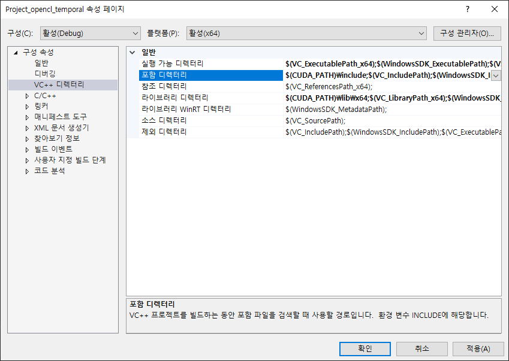
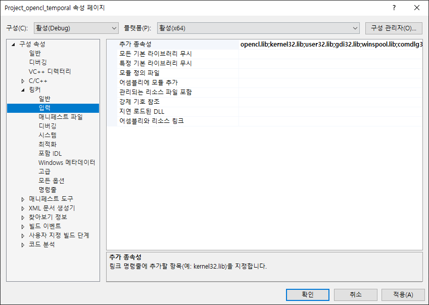
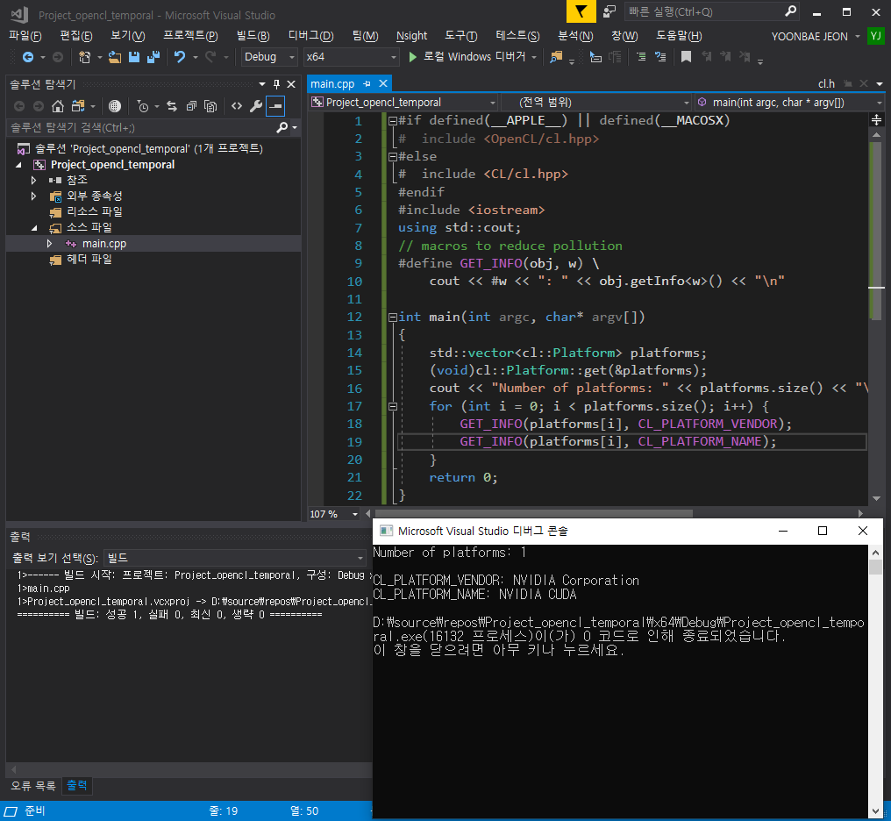

# OpenCL_Helper #

> **OpenCL** 프로그래밍 도우미.


### Build & Compile

> Nvidia 기준


### Windows ###

Tool: [VisualStudio](https://visualstudio.microsoft.com/ko/)

- 콘솔 프로젝트 생성 후 프로젝트 속성 설정하기
  - 포함 디렉터리: 맨 앞에 <code>$(CUDA_PATH)\\include;</code> 추가
  - 라이브러리 디렉터리: 맨 앞에 <code>$(CUDA_PATH)\\lib\\x64;</code> 추가
  - 링커 > 입력: 맨 앞에 <code>opencl.lib;</code> 추가






- 테스트 코드 작성

  ```c
  #if defined(__APPLE__) || defined(__MACOSX)
  #  include <OpenCL/cl.hpp>
  #else
  #  include <CL/cl.hpp>
  #endif
  #include <iostream>
  using std::cout;
  // macros to reduce pollution
  #define GET_INFO(obj, w) \
  	cout << #w << ": " << obj.getInfo<w>() << "\n"
  
  int main(int argc, char* argv[])
  {
  	std::vector<cl::Platform> platforms;
  	(void)cl::Platform::get(&platforms);
  	cout << "Number of platforms: " << platforms.size() << "\n\n";
  	for (int i = 0; i < platforms.size(); i++) {
  		GET_INFO(platforms[i], CL_PLATFORM_VENDOR);
  		GET_INFO(platforms[i], CL_PLATFORM_NAME);
  	}
  	return 0;
  }
  ```

  - 결과

    
